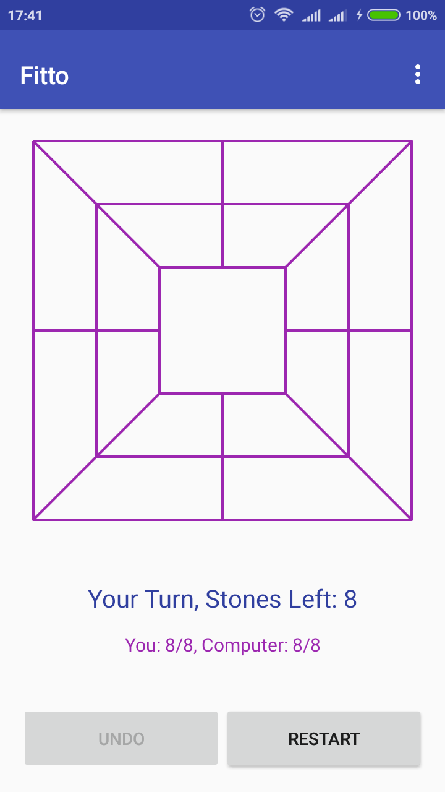
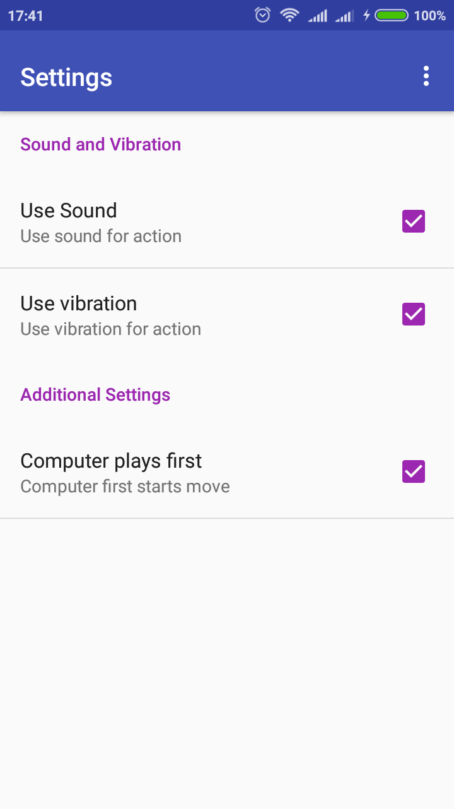
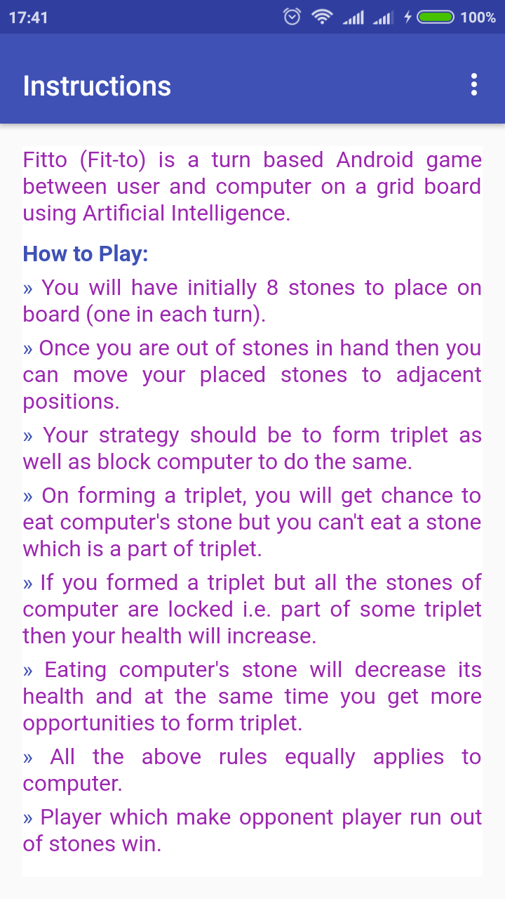
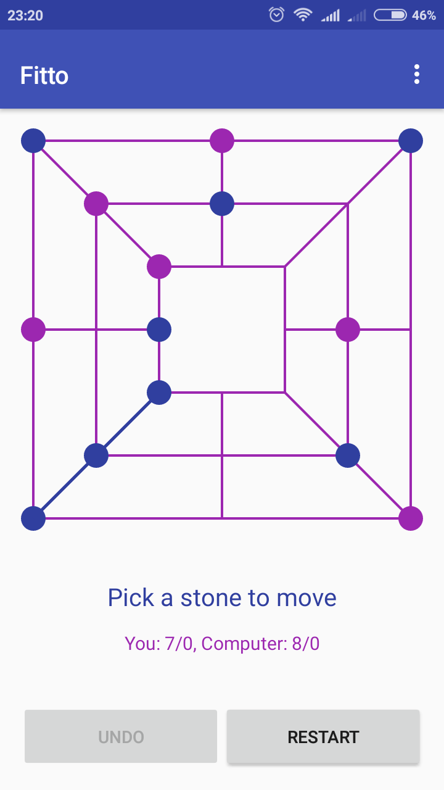

# Fitto (Fit-to)

Turn based Android game between user and computer on a grid board using Artificial Intelligence.

### How to Play:

* You will have initially 8 stones to place on board (one in each turn).
* Once you are out of stones in hand then you can move your placed stones to adjacent positions.
* Your strategy should be to form triplet as well as block computer to do the same.
* On forming a triplet, you will get chance to eat computer's stone but you can't eat a stone which is a part of triplet.
* If you formed a triplet but all the stones of computer are locked i.e. part of some triplet then your health will increase.
* Eating computer's stone will decrease its health and at the same time you get more opportunities to form triplet.
* All the above rules equally applies to computer.
* Player which make opponent player run out of stones win.

### Android app link
https://github.com/varunon9/Fitto/blob/master/app/app-release.apk

### Screenshots:

|  |  |
| --- | --- |
| | |
| | |

### How to contribute?
* Fork this repository.
* This is an Android-Studio project. Download zip and import into Android Studio.
* Fix bugs or make enhancements and make a pull requests.

#### Testing of android app:
* Android 4.2.2 Samsung(GT-S7582)
* Android 6.0.1 Redmi 4A

#### For query/issues open Github issue or contact: varunon9@gmail.com

